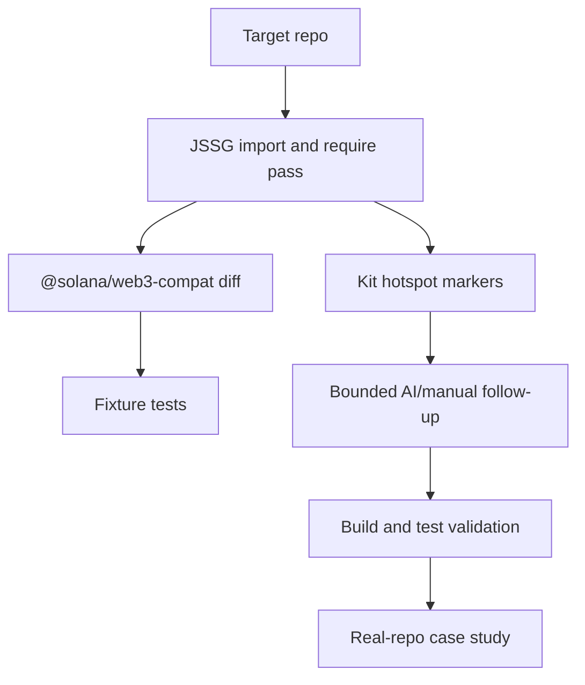

# System Design

## Selected Project

Name: Solana Compat Pilot

Repository/package: `solana-compat-pilot`

Purpose: safely migrate `@solana/web3.js` v1 projects onto the
`@solana/web3-compat` bridge and prepare full `@solana/kit` migration through
review markers and future direct transforms.

## Architecture



## Inputs

- JavaScript, TypeScript, JSX, and TSX source files.
- Existing imports or requires from `@solana/web3.js`.

## Processing

Deterministic layer:

- Parse files with JSSG/Tree-sitter.
- Match import declarations and CommonJS `require` calls.
- Rewrite only matched package string literals.
- Add one review marker when risky full-Kit hotspots are present.

AI/manual layer:

- Runs only against marked files.
- Keeps compat bridge unless direct Kit migration is provably safe.
- Must preserve behavior and pass validation before marker removal.

## Outputs

- Source diffs that replace `@solana/web3.js` with `@solana/web3-compat`.
- Optional `SOLANA_COMPAT_PILOT` marker comments explaining full-Kit risks.
- Fixture and real-repo validation reports.

## Safety

- No unsafe capabilities.
- No global string replacement.
- No direct rewrite of async signer or transaction semantics.
- False positives are treated as release blockers.

## UX

```bash
npx codemod workflow run -w workflow.yaml -t /path/to/repo --allow-dirty --no-interactive
```

## Milestones

1. MVP: package scaffold, import/require transform, fixtures.
2. Knowledge: docs, competition analysis, council review.
3. Validation: install dependencies, run JSSG fixtures and workflow validation.
4. Real repo: run against an open-source Solana repo and record findings.
5. Expansion: add direct-Kit transforms only after fixtures prove safety.

## Design Risk

This architecture is credible only if the runner is treated as part of the
product, not a wrapper around a tiny transform. Reports, rollback artifacts,
manifest migration, validation hooks, and real-repo replay are required for the
tool to be usable by production teams.
